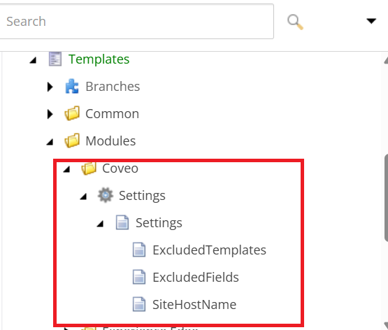
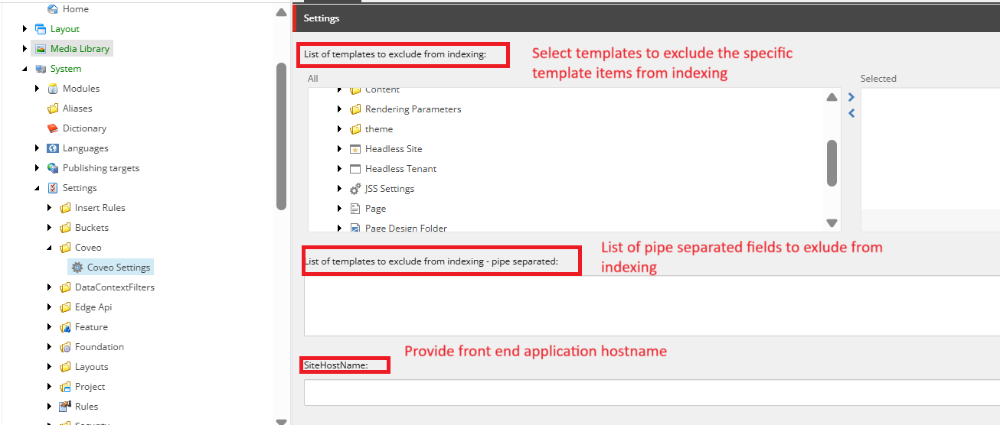
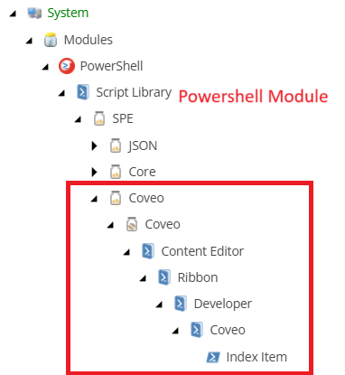
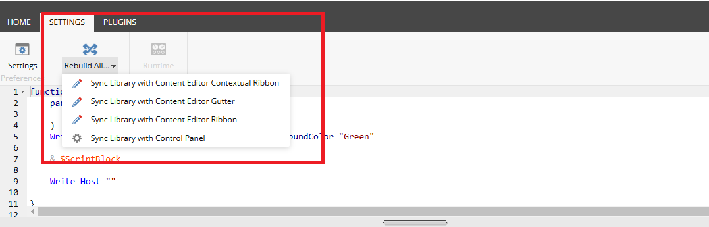
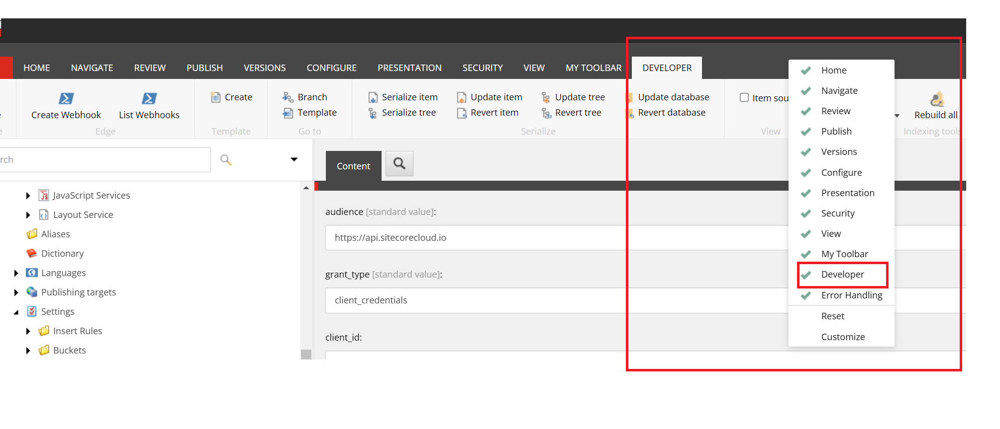
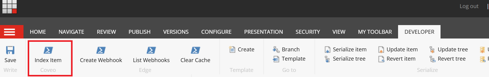
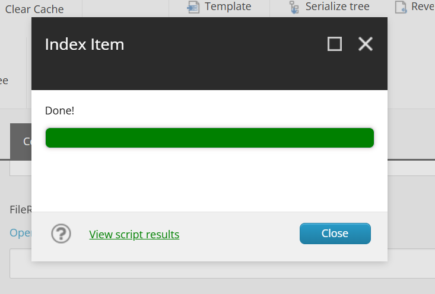
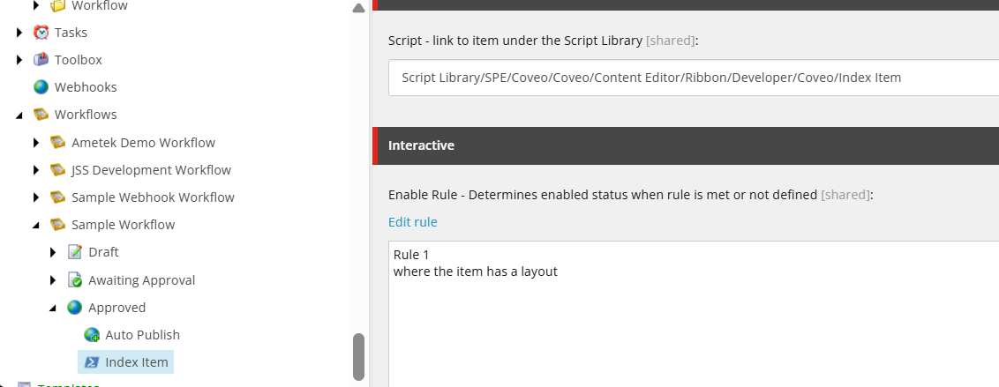

# xmcloud-coveo-push-connector
Sitecore powershell **(SPE) module** coveo connector to push the sitecore page item content to the coveo source.

# INSTALLATION

This tool can be added without code to any environment.

**Step 1: Install the Sitecore Package**

Download the Sitecore Package from this repo (xmcloud_coveo_push_package-1.0).

Install on your XM Cloud environments:

- Navigate to the XM Cloud application desktop 
- Select Developr tool, choose Install a package.
Repeat these steps for each environment where you want to install the package.

This package adds the following Sitecore Powershell Context Menu Extensions and Function items:

**Step 2: Add coveo configuration settings to the Sitecore XM cloud deploy project**

- Navigate to xm cloud deploy app from the sitecore cloud portal.
- Select the project from list of project for which this module has been installed.
- Select the environment from the list of environments for which this module has been installed.
- From the tabs, select variables tab and click on create variable.
- Add below variables 
    1. - Name - CoveoOrgId
       - Value - Pick the value from the coveo portal.
       - Secret - Make it secret if needed.
       - Target - Select CM

    2. - Name - CoveoSourceId
       - Value - Pick the source id of the coveo push source.
       - Secret - Make it secret if needed.
       - Target - Select CM

    3. - Name - CoveoSourceId
       - Value - Pick the value from the coveo portal for the given source in #2.
       - Secret - Make it secret if needed.
       - Target - Select CM
- Now trigger a deployment to this environment.

**Step 3: Sync powershell library with content editor ribbon**

- Navigate to powershell ISE from sitecore desktop developer tools.
- click on settings->Rebuild All dropdown ->Sync Library with Content Editor Ribbon.

**Step 4**: Enable Developer tab on ribbon

- Navigate to the sitecore desktop and right click ribbon.
- Select Developer from the list if the developer tab is not enabled

**Demo Screenshots**

Ribbon buttons 
- Index Item - to push the sitecore page item content. This button will be enabled only for the items which has layout.

    

- Index Item confirmation

    

- Output Results

    

**Use the Module in Workflow Approved State**

This module can be integrated with the workflow’s "Approved" state to automatically push content to Coveo once an item is approved and published.

- To achieve this, create a PowerShell script action under the Approved state in your workflow.

- After creating the action, specify the script path (Script Library/SPE/Coveo/Coveo/Content Editor/Ribbon/Developer/Coveo/Index Item) in the "Script - link to the item under the Script Library".

- In the Rules field, add the rule: "Where the item has a layout" to ensure only page items are targeted.
  
   

With this setup, whenever a page item is approved and published, it will also be pushed to the configured Coveo source automatically.

**NOTES:**

- If you need to use a specific field from the page item or its associated rendering datasource item as the image for search results, open the PowerShell script located at "/sitecore/system/Modules/PowerShell/Script Library/SPE/Coveo/Coveo/Content Editor/Ribbon/Developer/Coveo/Index Item" and assign the desired field name to the $imageFieldNameToUse variable. The value from this field will be used as the imageUrl in the search document, allowing it to appear as the image in the search results on the search page.

   

 

